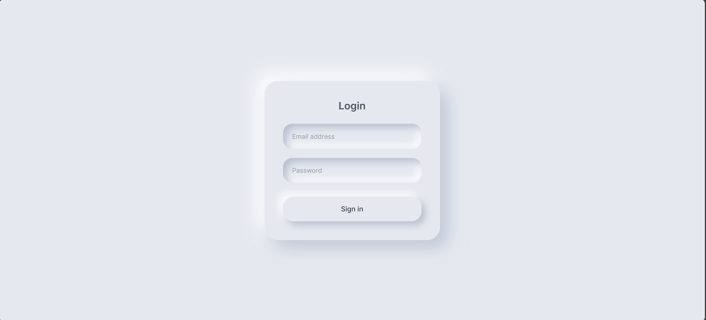

# Neumorphic Login UI

A clean 3D login UI inspired by neumorphism design principles, built using pure HTML and CSS.

## Preview

## Features
- Soft 3D depth (neumorphism)
- Clean and minimal layout
- Smooth shadows and spacing
- No JavaScript required
- Modern, calming UI

## Tech Stack
- HTML
- CSS

## Usage
Free to use for learning, practice, and personal projects.

---

Created by **WebParts Studios**
